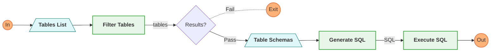
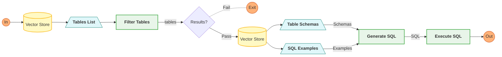
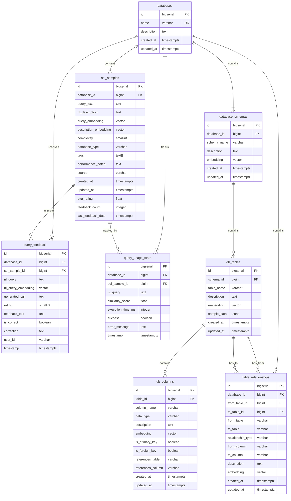
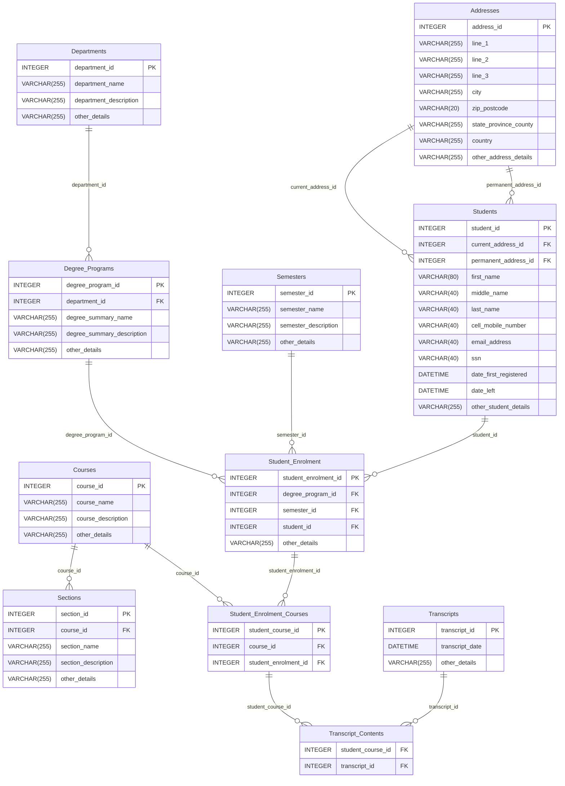

# Natural Lang to SQL
This is a pure python project for natural language to SQL completions with LLMs.

Much of the base project template was taken from [daveebbelaar](https://github.com/daveebbelaar/ai-cookbook/commits?author=daveebbelaar). 

## Agent process flow (basic)



## Agent process Flow (RAG)



## Vector Store

### No embedding_model table



## Database 
This project utilizes the `student_transcripts_tracking` database provided in Yale's [Spider 1.0 project](https://yale-lily.github.io/spider). This is a Text-to-SQL challenge where natural language queries were and the corresponding SQL was provided. They provide `sqlite` databases. cited as follows:

- Tao Yu, Rui Zhang, Kai Yang, Michihiro Yasunaga, Dongxu Wang, Zifan Li, James Ma, Irene Li, Qingning Yao, Shanelle Roman, Zilin Zhang, and Dragomir Radev. "Spider: A Large-Scale Human-Labeled Dataset for Complex and Cross-Domain Semantic Parsing and Text-to-SQL Task." *Proceedings of the 2018 Conference on Empirical Methods in Natural Language Processing*, Brussels, Belgium, Association for Computational Linguistics, 2018.

For more information, visit the [Spider repository](https://github.com/taoyds/spider).

### Data Files
This project is licensed under the **MIT License** (see LICENSE). It includes data files from the Spider project (located in data/spider/), which are licensed under the **Apache 2.0 License** (see data/spider/LICENSE).

I've included only the data related to the **student_transcripts_tracking** database in this project. I've kept the filenames as they exist in the spider project dataset -
```
 ./data
    /spider
      /sqlite
        schema.sql
        student_transcripts_tracking.sqlite
      dev.json
      LICENSE
      tables.json
```

The original database and the natural language examples are provided here - https://drive.usercontent.google.com/download?id=1403EGqzIDoHMdQF4c9Bkyl7dZLZ5Wt6J&export=download&authuser=0


### ERD



per Spider README.md -

### Data Content and Format
Question, SQL, and Parsed SQL
Each file in `train.json` and `dev.json` contains the following fields:

 - `question`: the natural language question
 - `question_toks`: the natural language question tokens
 - `db_id`: the database id to which this question is addressed.
 - `query`: the SQL query corresponding to the question.
 - `query_toks`: the SQL query tokens corresponding to the question.
 - `sql`: parsed results of this SQL query using process_sql.py. Please refer to parsed_sql_examples.sql in thepreprocess directory for the detailed documentation.

<details>
<summary>Click here</summary>

```json
 {
        "db_id": "world_1",
        "query": "SELECT avg(LifeExpectancy) FROM country WHERE Name NOT IN (SELECT T1.Name FROM country AS T1 JOIN countrylanguage AS T2 ON T1.Code  =  T2.CountryCode WHERE T2.Language  =  \"English\" AND T2.IsOfficial  =  \"T\")",
        "query_toks": ["SELECT", "avg", "(", "LifeExpectancy", ")", "FROM", ...],
        "question": "What is average life expectancy in the countries where English is not the official language?",
        "question_toks": ["What", "is", "average", "life", ...],
        "sql": {
            "except": null,
            "from": {
                "conds": [],
                "table_units": [
                    ...
            },
            "groupBy": [],
            "having": [],
            "intersect": null,
            "limit": null,
            "orderBy": [],
            "select": [
                ...
            ],
            "union": null,
            "where": [
                [
                    true,
                    ...
                    {
                        "except": null,
                        "from": {
                            "conds": [
                                [
                                    false,
                                    2,
                                    [
                                    ...
                        },
                        "groupBy": [],
                        "having": [],
                        "intersect": null,
                        "limit": null,
                        "orderBy": [],
                        "select": [
                            false,
                            ...
                        "union": null,
                        "where": [
                            [
                                false,
                                2,
                                [
                                    0,
                                   ...
        }
    },
```

</details>

### Tables
`tables.json` contains the following information for each database:

 - `db_id`: database id
 - `table_names_original`: original table names stored in the database.
 - `table_names`: cleaned and normalized table names. We make sure the table names are meaningful. [to be changed]
 - `column_names_original`: original column names stored in the database. Each column looks like: [0, "id"]. 0 is the index of table names in table_names, which is city in this case. "id" is the column name.
 - `column_names`: cleaned and normalized column names. We make sure the column names are meaningful. [to be changed]
 - `column_types`: data type of each column
 - `foreign_keys`: foreign keys in the database. [3, 8] means column indices in the column_names. These two columns are foreign keys of two different tables.
 - `primary_keys`: primary keys in the database. Each number is the index of column_names.

<details>
<summary>Click here</summary>

```json
{
    "column_names": [
      [
        0,
        "id"
      ],
      [
        0,
        "name"
      ],
      [
        0,
        "country code"
      ],
      [
        0,
        "district"
      ],
      .
      .
      .
    ],
    "column_names_original": [
      [
        0,
        "ID"
      ],
      [
        0,
        "Name"
      ],
      [
        0,
        "CountryCode"
      ],
      [
        0,
        "District"
      ],
      .
      .
      .
    ],
    "column_types": [
      "number",
      "text",
      "text",
      "text",
         .
         .
         .
    ],
    "db_id": "world_1",
    "foreign_keys": [
      [
        3,
        8
      ],
      [
        23,
        8
      ]
    ],
    "primary_keys": [
      1,
      8,
      23
    ],
    "table_names": [
      "city",
      "sqlite sequence",
      "country",
      "country language"
    ],
    "table_names_original": [
      "city",
      "sqlite_sequence",
      "country",
      "countrylanguage"
    ]
  }
```

</details>

## pytest
Can run from project root due to `pytest.ini` configuration.

## pattern matching
Below are the pattern matching algorithms implemented in the `app/utils/matching.py` -

**N-gram**: Breaks strings into sequences of n characters (e.g., for n=2, "hello" becomes ["he", "el", "ll", "lo"]) and compares these sequences. It’s useful for detecting similarities in character sequences, making it suitable for spelling correction and detecting partial matches.

**Phonetic**: Converts strings to phonetic codes based on how they sound (e.g., Soundex, Metaphone, Double Metaphone). It’s designed for matching names that sound alike but are spelled differently, such as "Smith" and "Smyth."

**Levenshtein**: Calculates the minimum number of single-character edits (insertions, deletions, or substitutions) required to change one string into another. It’s effective for detecting typos and small spelling mistakes, with similarity often normalized as 1 minus the distance divided by the string length.
Jaro-Winkler: An extension of the Jaro distance, it measures similarity with extra weight given to the prefix of strings and accounts for transpositions. It’s particularly effective for name matching, emphasizing common beginnings.

**Jaro-Winkler**: The Jaro-Winkler algorithm is a string similarity measure specifically designed for comparing short strings, such as names. It’s an extension of the Jaro distance, enhanced with a focus on prefix matching, making it particularly effective for tasks like name matching, record linkage, and data deduplication. Below, I’ll explain how it works, its benefits, challenges, and practical applications.

**Jaccard (with n-grams)**: Treats strings as sets of n-grams (e.g., character sequences) and computes similarity as the size of the intersection over the union of these sets. It’s less sensitive to order, making it suitable for detecting overlapping sequences but potentially less effective for transpositions.
Embeddings: Convert strings to vector representations using machine learning models, such as character-level RNNs, CNNs, or transformers. Similarity is determined by the distance between these vectors, capturing complex patterns learned from data, but requires training and may not be transparent.

**Embeddings**: Embedding-based name matching leverages machine learning to represent names as high-dimensional vectors, capturing complex patterns like spelling variations, phonetic similarities, and cultural nuances. Models such as BERT or FastText are trained on large datasets to convert names into vectors, where similarity is measured using metrics like cosine similarity. This approach offers high accuracy and excels at handling typos (e.g., "Jon" vs. "John"), multilingual names (e.g., "Muhammad" vs. "Mohamed"), and large-scale tasks like database deduplication or fuzzy search.

| Algorithm       | Measures character order | Handles insertions/deletions | Handles substitutions | Handles transpositions | Phonetic similarity | Computational efficiency        | Language specific            |
|-----------------|--------------------------|------------------------------|-----------------------|------------------------|---------------------|---------------------------------|------------------------------|
| N-gram          | Yes                      | Yes                          | Yes                   | Yes                    | No                  | Good                            | No                           |
| Phonetic        | No                       | Yes                          | Yes                   | Yes                    | Yes                 | Good                            | Yes                          |
| Levenshtein     | Yes                      | Yes                          | Yes                   | No                     | No                  | Good for short strings          | No                           |
| Jaro-Winkler    | Yes                      | Yes                          | Yes                   | Yes                    | No                  | Good                            | No                           |
| Jaccard (n-gram)| Partial                  | Yes                          | Yes                   | No                     | No                  | Good                            | No                           |
| Embeddings      | Yes                      | Yes (learned)                | Yes (learned)         | Yes (learned)          | No (unless trained) | Good for comparison, training intensive | Yes (trained on specific data) |

# references

## GitHub repos
- [ai-cookbook](https://github.com/daveebbelaar/ai-cookbook)
- [pgvectorscale RAG solution](https://github.com/daveebbelaar/pgvectorscale-rag-solution)

## YouTube tutorials
- [Building AI Agents in pure Python](https://www.youtube.com/watch?v=bZzyPscbtI8&t=14s)
- [Prompt Management 101 - Full Guide for AI Engineers](https://www.youtube.com/watch?v=Qddc_DNo9qY&t=1363s)
- [PostgreSQL as VectorDB - Beginner Tutorial](https://www.youtube.com/watch?v=Ff3tJ4pJEa4&t=248s)
- [Build high-performance RAG using just PostgreSQL (Full Tutoria](https://www.youtube.com/watch?v=hAdEuDBN57g&t=35s)
- [How to Implement Hybrid Search with PostgreSQL (Full Tutorial)](https://www.youtube.com/watch?v=TbtBhbLh0cc&t=2s)
- [Build Better LLM Apps with Assertion-Based Unit Tests](https://www.youtube.com/watch?v=bnvOk1fm0tw)

## Assertion Unit Tests
- [What We’ve Learned From A Year of Building with LLMs](https://applied-llms.org/#create-a-few-assertion-based-unit-tests-from-real-inputoutput-samples)

## Design Patterns
- [Build Effective Agents](https://www.anthropic.com/research/building-effective-agents)

## Pgvectorscale Documentation
- [GitHub Repository: pgvectorscale](https://github.com/timescale/pgvectorscale)
- [Blog Post: PostgreSQL and Pgvector: Now Faster Than Pinecone, 75% Cheaper, and 100% Open Source](https://www.timescale.com/blog/pgvector-is-now-as-fast-as-pinecone-at-75-less-cost/)
- [Blog Post: RAG Is More Than Just Vector Search](https://www.timescale.com/blog/rag-is-more-than-just-vector-search/)
- [Blog Post: A Python Library for Using PostgreSQL as a Vector Database in AI Applications](https://www.timescale.com/blog/a-python-library-for-using-postgresql-as-a-vector-database-in-ai-applications/)

## APIs
- [OpenAI API](https://platform.openai.com/docs/api-reference/introduction)