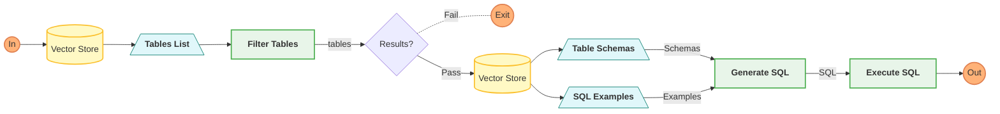
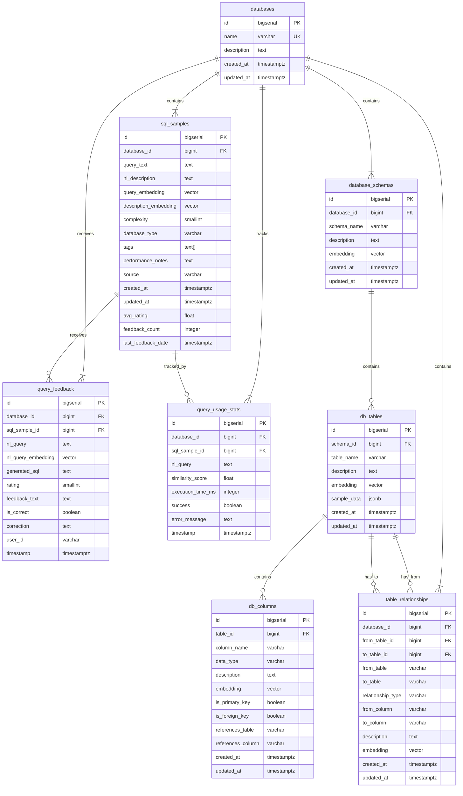

# Vector DB
We'll be using the PGVector feature for PostgreSQL for our Vector store.

## Agent Process Flow (RAG)



## ERD



## SQL DB Schema
```sql
-- Enable required extensions
CREATE EXTENSION IF NOT EXISTS timescaledb;
CREATE EXTENSION IF NOT EXISTS vector;

-- Track embedding models used
CREATE TABLE embedding_models (
    id SERIAL PRIMARY KEY,
    model_name VARCHAR(100) NOT NULL,
    dimensions INTEGER NOT NULL,
    provider VARCHAR(50) NOT NULL,
    version VARCHAR(50),
    created_at TIMESTAMPTZ NOT NULL DEFAULT NOW()
);

-- Track different database contexts
CREATE TABLE databases (
    id SERIAL PRIMARY KEY,
    name VARCHAR(100) NOT NULL UNIQUE,
    description TEXT,
    created_at TIMESTAMPTZ NOT NULL DEFAULT NOW(),
    updated_at TIMESTAMPTZ NOT NULL DEFAULT NOW()
);

-- Store SQL query examples
CREATE TABLE sql_samples (
    id SERIAL PRIMARY KEY,
    database_id INTEGER NOT NULL REFERENCES databases(id),
    query_text TEXT NOT NULL,
    nl_description TEXT NOT NULL,
    query_embedding VECTOR(1536) NOT NULL,
    description_embedding VECTOR(1536) NOT NULL,
    complexity SMALLINT,
    tags TEXT[],
    embedding_model_id INTEGER REFERENCES embedding_models(id),
    avg_rating FLOAT,
    feedback_count INTEGER DEFAULT 0,
    created_at TIMESTAMPTZ NOT NULL DEFAULT NOW(),
    updated_at TIMESTAMPTZ NOT NULL DEFAULT NOW(),
    CONSTRAINT fk_database FOREIGN KEY (database_id) REFERENCES databases(id)
);

-- Store database schema information
CREATE TABLE schema_metadata (
    id SERIAL PRIMARY KEY,
    database_id INTEGER NOT NULL REFERENCES databases(id),
    table_name VARCHAR(100) NOT NULL,
    description TEXT NOT NULL,
    embedding VECTOR(1536) NOT NULL,
    columns JSONB NOT NULL, -- Store column metadata
    sample_data JSONB, -- Optional sample data
    embedding_model_id INTEGER REFERENCES embedding_models(id),
    created_at TIMESTAMPTZ NOT NULL DEFAULT NOW(),
    updated_at TIMESTAMPTZ NOT NULL DEFAULT NOW(),
    CONSTRAINT fk_database FOREIGN KEY (database_id) REFERENCES databases(id),
    CONSTRAINT unique_table_per_db UNIQUE (database_id, table_name)
);

-- Store relationships between tables
CREATE TABLE table_relationships (
    id SERIAL PRIMARY KEY,
    database_id INTEGER NOT NULL REFERENCES databases(id),
    from_table VARCHAR(100) NOT NULL,
    to_table VARCHAR(100) NOT NULL,
    relationship_type VARCHAR(50) NOT NULL, -- e.g., "one-to-many"
    from_column VARCHAR(100) NOT NULL,
    to_column VARCHAR(100) NOT NULL,
    description TEXT,
    embedding VECTOR(1536),
    created_at TIMESTAMPTZ NOT NULL DEFAULT NOW(),
    updated_at TIMESTAMPTZ NOT NULL DEFAULT NOW(),
    CONSTRAINT fk_database FOREIGN KEY (database_id) REFERENCES databases(id)
);

-- Track user feedback on SQL queries
CREATE TABLE query_feedback (
    id SERIAL PRIMARY KEY,
    database_id INTEGER NOT NULL REFERENCES databases(id),
    sql_sample_id INTEGER REFERENCES sql_samples(id),
    nl_query TEXT NOT NULL,
    nl_query_embedding VECTOR(1536) NOT NULL,
    generated_sql TEXT NOT NULL,
    is_correct BOOLEAN NOT NULL,
    feedback_text TEXT,
    rating SMALLINT CHECK (rating BETWEEN 1 AND 5),
    timestamp TIMESTAMPTZ NOT NULL DEFAULT NOW(),
    CONSTRAINT fk_database FOREIGN KEY (database_id) REFERENCES databases(id),
    CONSTRAINT fk_sql_sample FOREIGN KEY (sql_sample_id) REFERENCES sql_samples(id)
);

-- Track query execution statistics
CREATE TABLE query_usage_stats (
    id SERIAL PRIMARY KEY,
    database_id INTEGER NOT NULL REFERENCES databases(id),
    sql_sample_id INTEGER REFERENCES sql_samples(id),
    nl_query TEXT NOT NULL,
    similarity_score FLOAT,
    execution_time_ms INTEGER,
    success BOOLEAN,
    error_message TEXT,
    timestamp TIMESTAMPTZ NOT NULL DEFAULT NOW(),
    CONSTRAINT fk_database FOREIGN KEY (database_id) REFERENCES databases(id),
    CONSTRAINT fk_sql_sample FOREIGN KEY (sql_sample_id) REFERENCES sql_samples(id)
);

-- Convert time-series tables to hypertables
SELECT create_hypertable('sql_samples', 'created_at');
SELECT create_hypertable('query_feedback', 'timestamp');
SELECT create_hypertable('query_usage_stats', 'timestamp');

-- Create vector similarity indexes
CREATE INDEX idx_sql_samples_query_embedding ON sql_samples USING hnsw (query_embedding vector_cosine_ops);
CREATE INDEX idx_sql_samples_description_embedding ON sql_samples USING hnsw (description_embedding vector_cosine_ops);
CREATE INDEX idx_schema_metadata_embedding ON schema_metadata USING hnsw (embedding vector_cosine_ops);
CREATE INDEX idx_table_relationships_embedding ON table_relationships USING hnsw (embedding vector_cosine_ops);
CREATE INDEX idx_query_feedback_nl_embedding ON query_feedback USING hnsw (nl_query_embedding vector_cosine_ops);

-- Create standard indexes for filtering
CREATE INDEX idx_sql_samples_database_id ON sql_samples (database_id);
CREATE INDEX idx_schema_metadata_database_id ON schema_metadata (database_id);
CREATE INDEX idx_table_relationships_database_id ON table_relationships (database_id);
CREATE INDEX idx_query_feedback_database_id ON query_feedback (database_id);
CREATE INDEX idx_query_usage_stats_database_id ON query_usage_stats (database_id);

-- Additional useful indexes
CREATE INDEX idx_sql_samples_tags ON sql_samples USING GIN (tags);
CREATE INDEX idx_schema_metadata_table_name ON schema_metadata (database_id, table_name);
CREATE INDEX idx_query_feedback_is_correct ON query_feedback (is_correct);
CREATE INDEX idx_query_feedback_rating ON query_feedback (rating);
```